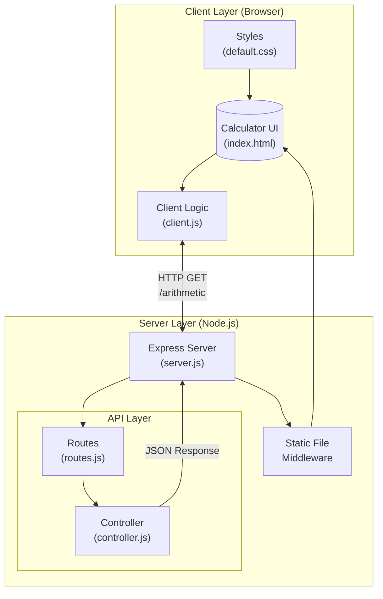
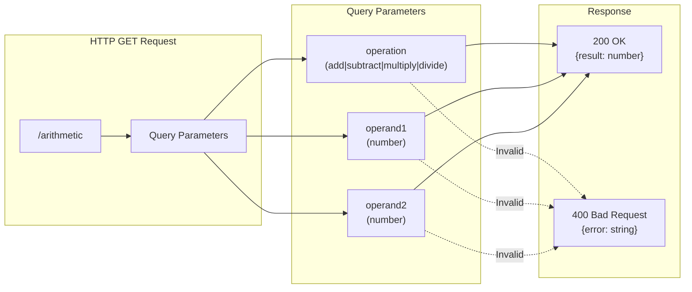
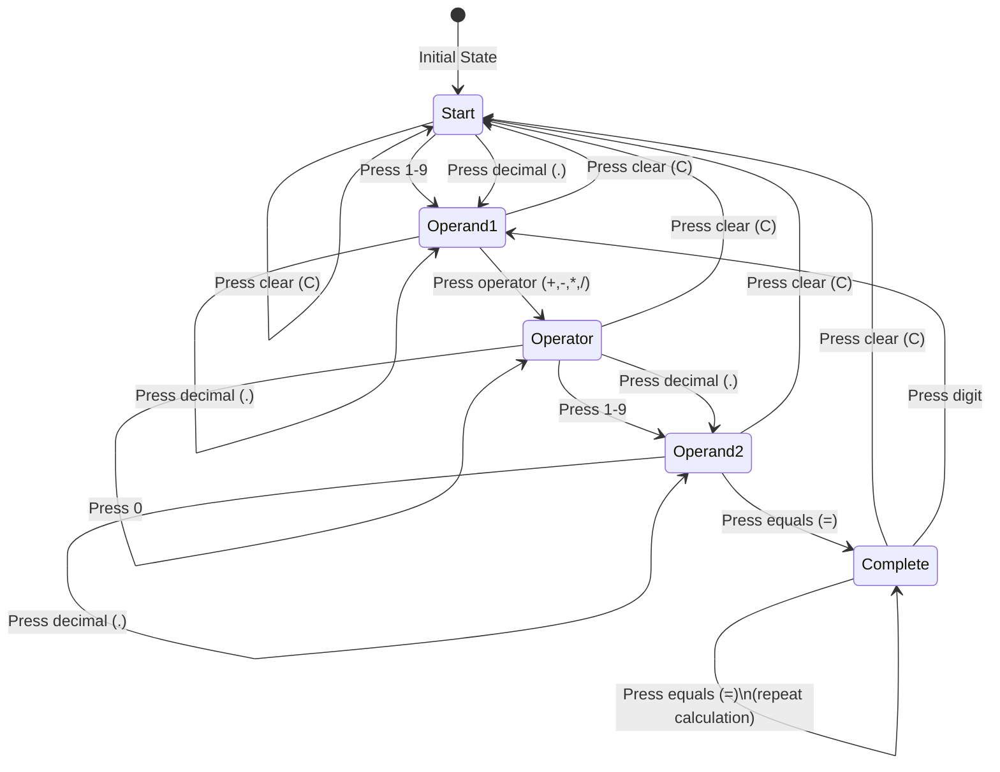
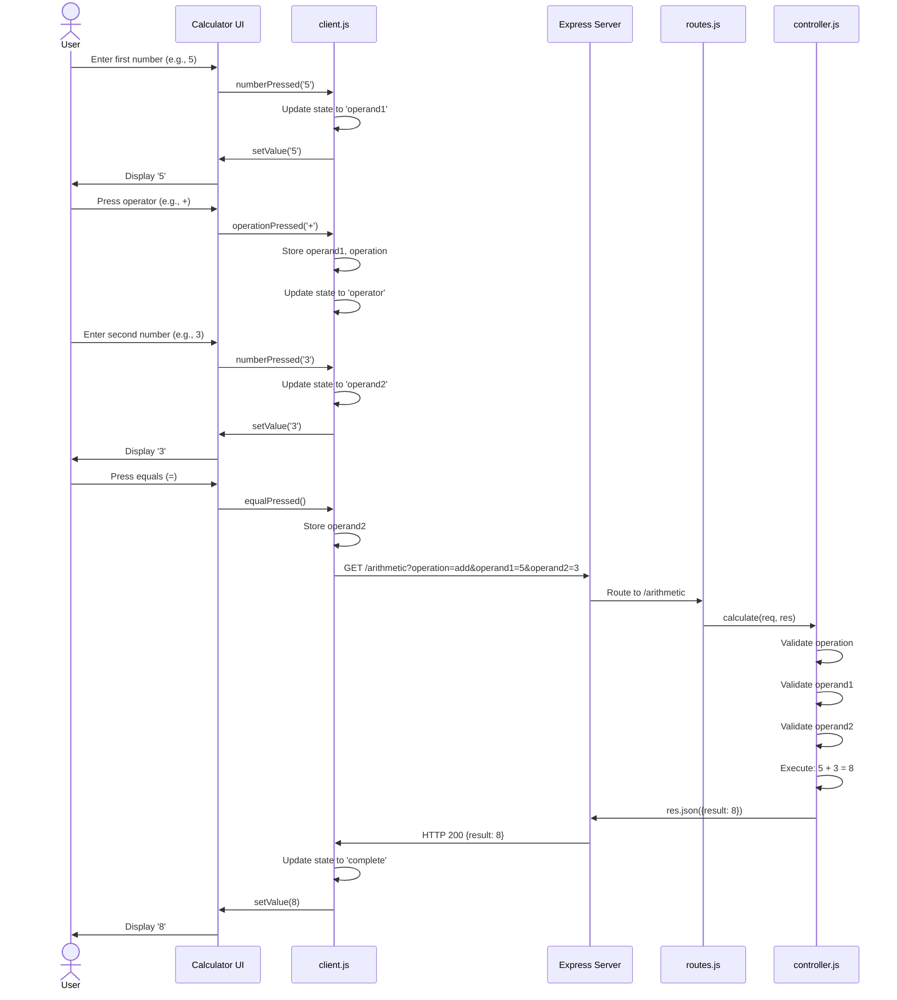

# Node.js Calculator Application Documentation

## Table of Contents

- [Project Overview](#project-overview)
- [Technology Stack](#technology-stack)
- [Architecture Diagram](#architecture-diagram)
- [API Endpoint Documentation](#api-endpoint-documentation)
- [Client State Machine](#client-state-machine)
- [Sequence Diagram](#sequence-diagram)
- [Project Structure](#project-structure)
- [Getting Started](#getting-started)

---

## Project Overview

The Node.js Calculator is a web-based calculator application that provides basic arithmetic operations through a clean, browser-based interface. The application follows a client-server architecture where the client handles user input and display, while the server performs the actual calculations through a RESTful API.

### Key Features

- **Basic Arithmetic Operations**: Addition, subtraction, multiplication, and division
- **Responsive Web Interface**: Browser-based calculator UI
- **RESTful API**: Clean API endpoints for calculation operations
- **Input Validation**: Server-side validation for operands and operations
- **Keyboard Support**: Users can input numbers and operations via keyboard

---

## Technology Stack

| Component | Technology |
|-----------|------------|
| **Runtime** | Node.js |
| **Web Framework** | Express.js ^4.16.4 |
| **Development Server** | Nodemon ^2.0.20 |
| **Testing Framework** | Mocha ^5.2.0 |
| **Assertion Library** | Chai ^4.2.0 |
| **HTTP Testing** | Supertest ^3.4.2 |
| **Code Coverage** | NYC ^13.3.0 |
| **Linting** | ESLint ^8.29.0 |
| **Build Tools** | Gulp ^4.0.0 |

---

## Architecture Diagram

The following diagram illustrates the high-level architecture of the calculator application:



---

## API Endpoint Documentation

### `/arithmetic` Endpoint

The calculator exposes a single REST API endpoint for performing arithmetic calculations.



### API Reference

| Method | Endpoint | Description |
|--------|----------|-------------|
| GET | `/arithmetic` | Performs arithmetic calculation |

### Query Parameters

| Parameter | Type | Required | Description | Valid Values |
|-----------|------|----------|-------------|--------------|
| `operation` | string | Yes | The arithmetic operation to perform | `add`, `subtract`, `multiply`, `divide` |
| `operand1` | number | Yes | The first operand | Any valid number (supports decimals and scientific notation) |
| `operand2` | number | Yes | The second operand | Any valid number (supports decimals and scientific notation) |

### Example Requests

```bash
# Addition: 5 + 3 = 8
GET /arithmetic?operation=add&operand1=5&operand2=3

# Subtraction: 10 - 4 = 6
GET /arithmetic?operation=subtract&operand1=10&operand2=4

# Multiplication: 6 * 7 = 42
GET /arithmetic?operation=multiply&operand1=6&operand2=7

# Division: 20 / 4 = 5
GET /arithmetic?operation=divide&operand1=20&operand2=4
```

### Response Format

**Success Response (200 OK):**
```json
{
  "result": 8
}
```

**Error Response (400 Bad Request):**
```json
{
  "error": "Invalid operation: modulo"
}
```

---

## Client State Machine

The client-side calculator operates using a finite state machine to manage user input and calculation flow:



### State Descriptions

| State | Value | Description |
|-------|-------|-------------|
| `start` | 0 | Initial state, display shows 0, waiting for first input |
| `operand1` | 1 | User is entering the first operand |
| `operator` | 2 | First operand entered, waiting for operator or second operand |
| `operand2` | 3 | User is entering the second operand |
| `complete` | 4 | Calculation complete, result displayed |

---

## Sequence Diagram

The following diagram shows the complete flow of a calculation request:



---

## Project Structure

```
copilot-node-calculator-main/
│
├── server.js              # Express server entry point
├── package.json           # Project dependencies and scripts
├── gulpfile.js            # Gulp build configuration
├── README.md              # Project readme
├── documentation.md       # This documentation file
├── LICENSE                # MIT License
│
├── api/                   # API layer
│   ├── controller.js      # Business logic for calculations
│   └── routes.js          # Route definitions
│
├── public/                # Static files served to client
│   ├── index.html         # Calculator UI
│   ├── client.js          # Client-side JavaScript
│   └── default.css        # Stylesheet
│
├── test/                  # Test files
│   ├── arithmetic.test.js # API endpoint tests
│   ├── helpers.js         # Test helper functions
│   └── config.json        # Mocha reporter configuration
│
├── coverage/              # Test coverage reports
│   ├── index.html         # Coverage report
│   └── cobertura-coverage.xml
│
└── assets/                # Additional assets
```

### Key Files

| File | Description |
|------|-------------|
| `server.js` | Main Express server setup, serves static files and mounts API routes |
| `api/routes.js` | Defines the `/arithmetic` endpoint routing |
| `api/controller.js` | Contains calculation logic and input validation |
| `public/client.js` | Client-side state machine and API communication |
| `public/index.html` | Calculator user interface |

---

## Getting Started

### Prerequisites

- **Node.js** (v14.x or higher recommended)
- **npm** (comes with Node.js)

### Installation

1. **Clone the repository:**
   ```bash
   git clone https://github.com/demo/node-calculator.git
   cd node-calculator
   ```

2. **Install dependencies:**
   ```bash
   npm install
   ```

### Running the Application

**Development mode (with auto-restart):**
```bash
npm start
```

The application will start on `http://localhost:3000` (or the port specified in the `PORT` environment variable).

**Direct execution:**
```bash
node server.js
```

### Running Tests

**Run tests with coverage report:**
```bash
npm test
```

This command will:
- Execute all tests using Mocha
- Generate coverage reports (Cobertura XML, HTML, and text)
- Create JUnit-compatible test results

**Run tests manually:**
```bash
npx mocha --require ./test/helpers.js --timeout 10000 test/arithmetic.test.js
```

### Linting

**Check code style:**
```bash
npm run lint
```

### Build

**Run build (currently a no-op):**
```bash
npm run build
```

---

## Environment Variables

| Variable | Description | Default |
|----------|-------------|---------|
| `PORT` | Port number for the server | `3000` |

---

## Error Handling

The API handles the following error cases:

| Error | HTTP Status | Message |
|-------|-------------|---------|
| Missing operation | 400 | "Unspecified operation" |
| Invalid operation | 400 | "Invalid operation: {operation}" |
| Invalid operand1 | 400 | "Invalid operand1: {value}" |
| Invalid operand2 | 400 | "Invalid operand2: {value}" |

---

## License

This project is licensed under the MIT License - see the [LICENSE](LICENSE) file for details.
